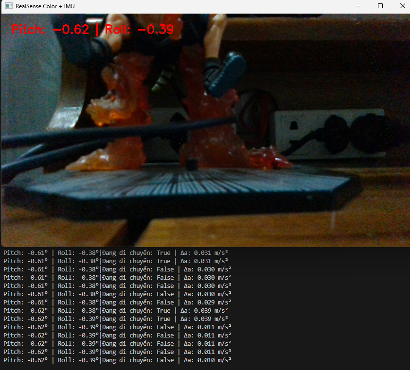
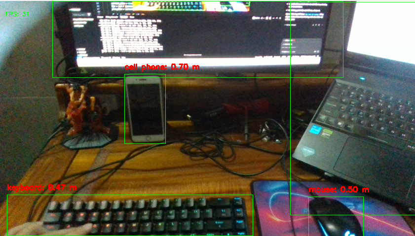
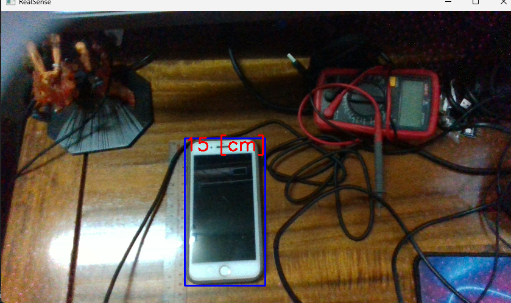
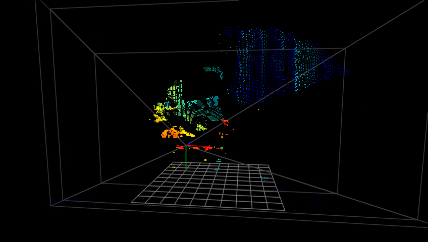
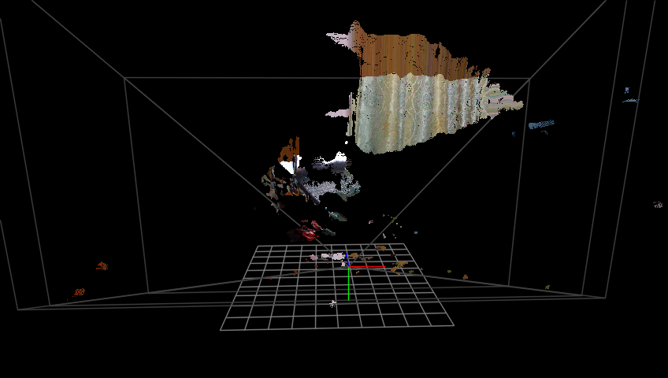
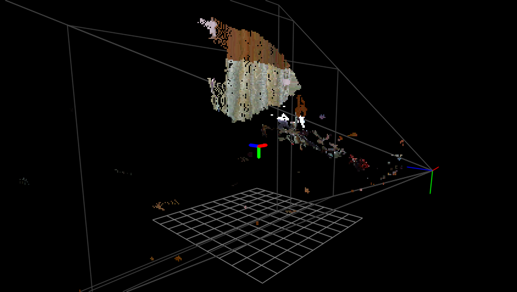

# DepthCam Project

> 🌐 **Ngôn ngữ | Language:**  
> [🇻🇳 Tiếng Việt](#nội-dung-tiếng-việt) | [🇺🇸 English](#english-content)

---

## Nội dung tiếng Việt

# Dự án DepthCam - Hướng dẫn sử dụng và giải thích mã nguồn

## Tổng quan
Dự án này sử dụng camera Intel RealSense D435 kết hợp với các mô hình AI (YOLO) để thực hiện các tác vụ như: nhận diện đối tượng, đo khoảng cách, đo chiều cao, dựng point cloud 3D, và đọc dữ liệu IMU (cảm biến chuyển động). Dưới đây là giải thích chi tiết cho từng file Python trong từng thư mục.

---

## Thư mục gốc

### `convert.py`
- **Chức năng:** Chạy thử nghiệm mô hình YOLO (yolo11n.pt) trên webcam (source=0), hiển thị kết quả nhận diện đối tượng trực tiếp.
- **Ý nghĩa:** Dùng để kiểm tra nhanh mô hình YOLO đã hoạt động đúng chưa và chuyển sang model convert.

#### Demo sử dụng:
```python
from ultralytics import YOLO
model = YOLO(r"yolo11n.pt")
model.predict(source=0, imgsz=640, conf=0.7, show=True)
```

### `get_config.py`
- **Chức năng:** Liệt kê thông tin chi tiết về các thiết bị RealSense đang kết nối, bao gồm các cảm biến và cấu hình stream mà từng cảm biến hỗ trợ.
- **Ý nghĩa:** Hữu ích để kiểm tra camera đã kết nối, xem các chế độ stream khả dụng.

#### Demo sử dụng:
```python
import pyrealsense2 as rs
context = rs.context()
devices = context.query_devices()
for device in devices:
    print(device.get_info(rs.camera_info.name))
```

---

## Thư mục `IMU/`

### `camera_IMU.py`
- **Chức năng:** Đọc dữ liệu từ cảm biến IMU (gyro, accel) và stream màu của camera. Tính toán góc pitch/roll dựa trên dữ liệu gyro, chỉ cập nhật khi phát hiện chuyển động mạnh (dựa vào biến thiên gia tốc). Hiển thị góc lên khung hình màu.
- **Ý nghĩa:** Giúp quan sát trực quan góc nghiêng của camera khi di chuyển, phục vụ các ứng dụng robot, AR/VR, v.v.

#### Demo sử dụng:
```python
# Chạy script để xem góc nghiêng trực tiếp trên hình ảnh
python IMU/camera_IMU.py
```



### `get_IMU.py`
- **Chức năng:** Đọc dữ liệu IMU (gyro, accel), tính toán góc pitch/roll tương tự như trên nhưng không hiển thị hình ảnh, chỉ in ra console.
- **Ý nghĩa:** Dùng cho debug nhanh hoặc các ứng dụng chỉ cần dữ liệu góc nghiêng.

#### Demo sử dụng:
```python
python IMU/get_IMU.py
```

---

## Thư mục `distance_object/`

### `distance.py`
- **Chức năng:** Kết hợp YOLO để nhận diện đối tượng trên khung hình màu, đồng thời đo khoảng cách từ camera đến đối tượng (dùng depth map). Khoảng cách được làm mượt bằng bộ lọc số.
- **Ý nghĩa:** Ứng dụng đo khoảng cách vật thể theo thời gian thực, ví dụ robot tránh vật, đo khoảng cách người/vật.

#### Demo sử dụng:
```python
python distance_object/distance_multy_ob.py
```



---

## Thư mục `height_object/`

### `height_person.py`
- **Chức năng:** Nhận diện người bằng YOLO, lấy point cloud trong vùng bbox, tính chiều cao người dựa trên dữ liệu 3D, lọc nhiễu bằng Kalman, bù trừ sai số.
- **Ý nghĩa:** Đo chiều cao người tự động, ứng dụng trong kiểm tra sức khỏe, robot, v.v.

#### Demo sử dụng:
```python
python height_object/height_person.py
```



---

## Thư mục `education_demo/`

### `point_cloud.py`
- **Chức năng:** Dựng và hiển thị point cloud 3D từ camera RealSense, cho phép xoay, zoom, dịch chuyển bằng chuột/phím. Có thể lưu ảnh, xuất file PLY.
- **Ý nghĩa:** Trực quan hóa dữ liệu 3D, phục vụ demo giáo dục, nghiên cứu, kiểm tra chất lượng dữ liệu depth.

#### Demo sử dụng:
```python
python education_demo/point_cloud.py
```

Ví dụ ảnh minh họa:
- 
- 
- 

---

## Thư mục `model/`

### `yolo11n.pt`
- **Chức năng:** File trọng số mô hình YOLO11n đã huấn luyện, dùng cho các file nhận diện đối tượng.
- **Ý nghĩa:** Không chỉnh sửa file này, chỉ dùng để nạp vào các script nhận diện.

---

## Lưu ý chung
- Để chạy được các file, cần cài đặt các thư viện: `pyrealsense2`, `opencv-python`, `ultralytics`, `numpy`, v.v.
- Đảm bảo đã kết nối camera Intel RealSense D435 trước khi chạy các script.
- Một số file ảnh (`image.png`, `focus.png`, ...) chỉ dùng minh họa, không ảnh hưởng code.

---

Mọi thắc mắc hoặc cần hỗ trợ, vui lòng liên hệ tác giả dự án [BaoHan1712](https://github.com/BaoHan1712)

---

## English Content

# DepthCam Project - User Guide and Source Code Explanation

## Overview
This project uses the Intel RealSense D435 camera combined with YOLO AI models to perform tasks such as object detection, distance measurement, height estimation, 3D point cloud rendering, and IMU (motion sensor) data reading. Below is a detailed explanation for each Python file in every folder.

---

## Root Folder

### `convert.py`
- **Function:** Test the YOLO (yolo11n.pt) model on webcam (source=0), display real-time object detection results.
- **Purpose:** Quickly check if the YOLO model is working and for model conversion.

#### Demo usage:
```python
from ultralytics import YOLO
model = YOLO(r"yolo11n.pt")
model.predict(source=0, imgsz=640, conf=0.7, show=True)
```

### `get_config.py`
- **Function:** List detailed information about connected RealSense devices, including sensors and supported stream profiles.
- **Purpose:** Useful for checking if the camera is connected and viewing available stream modes.

#### Demo usage:
```python
import pyrealsense2 as rs
context = rs.context()
devices = context.query_devices()
for device in devices:
    print(device.get_info(rs.camera_info.name))
```

---

## Folder `IMU/`

### `camera_IMU.py`
- **Function:** Read IMU (gyro, accel) data and color stream from the camera. Calculate pitch/roll angles based on gyro data, only updating when strong movement is detected (based on acceleration variation). Display angles on the color frame.
- **Purpose:** Visualize camera tilt in real time, useful for robotics, AR/VR, etc.

#### Demo usage:
```python
# Run the script to see real-time tilt angles on the image
python IMU/camera_IMU.py
```


### `get_IMU.py`
- **Function:** Read IMU (gyro, accel) data, calculate pitch/roll angles similarly but only print to console, no image display.
- **Purpose:** For quick debugging or applications that only need tilt data.

#### Demo usage:
```python
python IMU/get_IMU.py
```

---

## Folder `distance_object/`

### `distance.py`
- **Function:** Combine YOLO for object detection on the color frame and measure the distance from the camera to the object (using depth map). Distance is smoothed by a digital filter.
- **Purpose:** Real-time object distance measurement, e.g., for robot obstacle avoidance, measuring distance to people/objects.

#### Demo usage:
```python
python distance_object/distance_multy_ob.py
```


---

## Folder `height_object/`

### `height_person.py`
- **Function:** Detect people using YOLO, extract point cloud in the bounding box, calculate height based on 3D data, filter noise with Kalman, and compensate for errors.
- **Purpose:** Automatic human height measurement, useful for health check, robotics, etc.

#### Demo usage:
```python
python height_object/height_person.py
```


---

## Folder `education_demo/`

### `point_cloud.py`
- **Function:** Render and display 3D point cloud from RealSense camera, allow rotation, zoom, translation with mouse/keyboard. Can save images or export PLY files.
- **Purpose:** Visualize 3D data, useful for education, research, or checking depth data quality.

#### Demo usage:
```python
python education_demo/point_cloud.py
```

Example images:
- 
- 
- 

---

## Folder `model/`

### `yolo11n.pt`
- **Function:** Pretrained YOLO11n model weights, used for object detection scripts.
- **Purpose:** Do not modify this file, only load it in detection scripts.

---

## General Notes
- To run the scripts, install: `pyrealsense2`, `opencv-python`, `ultralytics`, `numpy`, etc.
- Make sure the Intel RealSense D435 camera is connected before running scripts.
- Some image files (`image.png`, `focus.png`, ...) are for illustration only, not required for code.

---

For any questions or support, please contact the project author [BaoHan1712](https://github.com/BaoHan1712)